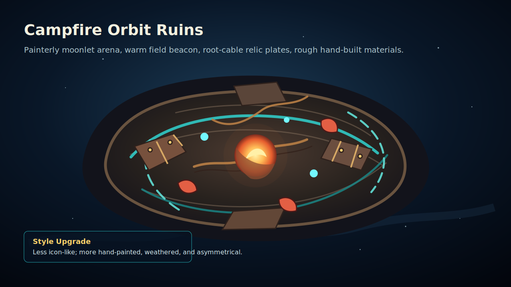
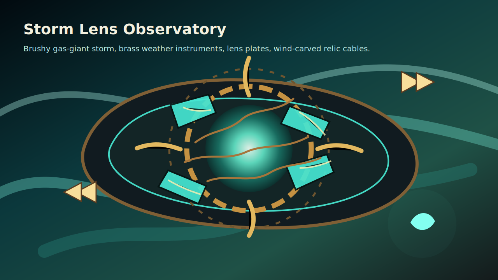
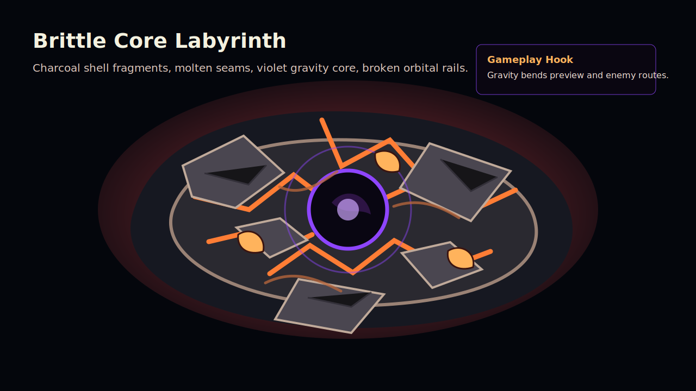
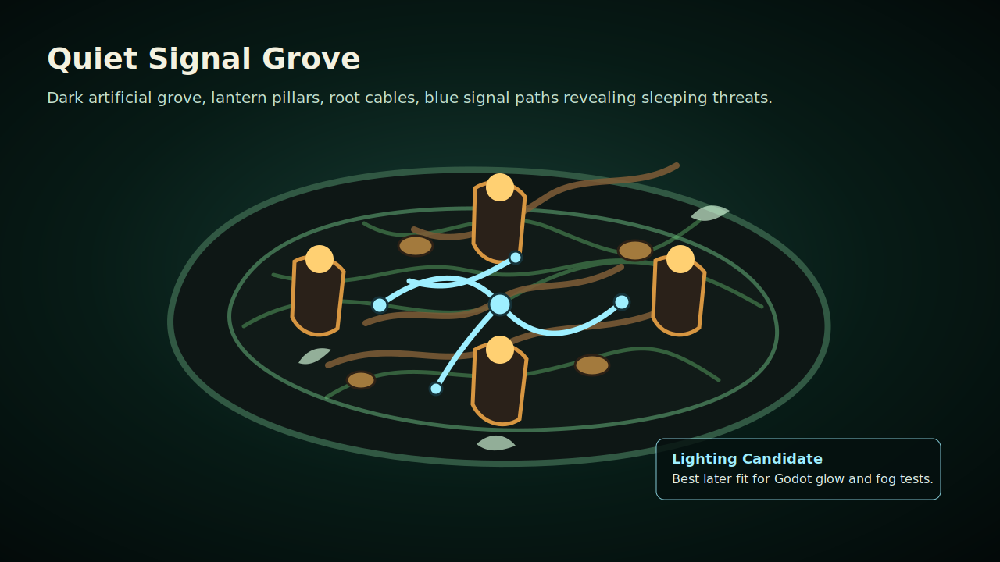

# Outer Wilds Reference And Original Concept Study

> Scope: internal visual research and original concept direction for Cannonball Relic.
> Do not import, trace, crop, recolor, or ship Outer Wilds screenshots, logos, ships, species, UI, symbols, or map layouts.

## Quick Visual Board

### Official Reference Images

These are hotlinked official/public reference images for mood study only. They are not project assets.

| Reference | Image |
|---|---|
| Outer Wilds official page hero/background |  |
| Echoes of the Eye official page hero/background |  |
| Early concept / campaign wallpaper |  |
| Mobius dev post reference image |  |
| Mobius dev post reference image |  |

### Original Concept Boards For Cannonball Relic

These sketches are original direction boards for our game. They are intentionally not copies of Outer Wilds locations, props, symbols, ships, species, or UI.









## Reference Image Sources

Use these only as mood/reference material.

| Source | What To Study | Notes |
|---|---|---|
| Mobius Digital - Outer Wilds official page | Small solar system, time-changing planets, campfire / space-adventure tone, official wallpaper zip | Official source; safest reference entry point. https://www.mobiusdigitalgames.com/outer-wilds.html |
| Mobius Digital - Outer Wilds wallpaper zip | Official wallpaper pack | Reference only. https://www.mobiusdigitalgames.com/uploads/4/7/3/2/47328935/wallpapers.zip |
| Mobius Digital - Echoes of the Eye official page | Darker mystery tone, hidden structure, lantern-like mood, DLC wallpaper zip | Use mood only; avoid recognizable DLC architecture and iconography. https://www.mobiusdigitalgames.com/outer-wilds---echoes-of-the-eye.html |
| Mobius Digital - Echoes of the Eye wallpaper zip | Official DLC wallpaper pack | Reference only. https://www.mobiusdigitalgames.com/uploads/4/7/3/2/47328935/eote_wallpapers_1.zip |
| Mobius Digital - "Wallpaper, Concept Art, GIFs" dev post | Early concept art, logo direction, art-direction GIF | Good for process reference and abstraction level. https://www.mobiusdigitalgames.com/news/wallpaper-concept-art-gifs |
| Mobius Digital - "Changing The Outer Wilds Art Style" dev post | How the art direction moved from placeholder simplicity toward refined "camping in space" | Useful for our own art pipeline: keep silhouettes simple, polish surfaces and atmosphere. https://www.mobiusdigitalgames.com/news/changing-the-outer-wilds-art-style |
| Annapurna / Steam store pages | Public screenshots for planet biomes, ship views, ruins, hazards | Use as visual taxonomy, not asset source. https://store.steampowered.com/app/753640/Outer_Wilds/ |
| Bilibili opus: "星际拓荒概念设计1" | Chinese mirror/translation of Ian Jacobson concept work notes | Useful for quick browsing and Chinese annotations. Original source is still preferred. https://www.bilibili.com/opus/759419422973624324 |
| Ian Jacobson - Outer Wilds concept design | Nomai visual development, suits, masks, props, architecture, posters, icons | Strongest reference for "ancient but advanced" prop language. Reference only. https://www.ianjacobson.com/Outer-Wilds |
| Official / retail art books | Production art, posters, maps, design process | Useful for learning composition; do not scan or reuse book content. |

## Visual Language Takeaways

- **Emotional core:** cozy curiosity against cosmic danger. A warm local anchor such as campfire, lantern, signal beacon, or small cabin makes the vast environment less sterile.
- **Scale trick:** small playable body versus huge celestial forms. The world feels large through horizon curves, orbiting debris, giant weather systems, and distant silhouettes.
- **Material contrast:** hand-built wood / cloth / brass against stone, ice, sand, water, and ancient alien structures.
- **Readable mystery:** ruins should look functional but not immediately explained. Repeated symbols, broken machinery, and environmental loops invite interpretation.
- **Dynamic world:** the best references are not static planets; they change over time through sand, collapse, storms, gravity, light, or orbit.
- **Palette behavior:** warm orange lights and teal/cyan signals sit on deep blue-black space; hazardous biomes use one strong accent color.
- **Ancient-advanced balance:** the Ian Jacobson reference is especially useful for shapes that feel archaeological and technical at the same time.
- **Nature-machine hybrid:** plant, root, horn, leaf, shell, and bone language can soften sci-fi props and keep them mysterious without making them hostile.
- **Function-first props:** masks, cores, bridge pieces, stations, diagrams, posters, and achievement icons all read clearly because each object has a job before it has decoration.

## Actual-Painting Style Targets

The first visual board was too clean and diagram-like. The next art pass should push toward these traits:

- **Painterly surfaces:** use mottled color fields, rough silhouettes, and imperfect brush-like edges instead of single flat fills.
- **Warm/cool light composition:** use warm amber local lights against blue-green or violet cosmic darkness.
- **Weathered construction:** surfaces should show chips, seams, rivets, cracks, scorch marks, and mineral stains.
- **Asymmetric ancient tech:** avoid perfect sci-fi panels; use curved rails, root-like cables, leaf vents, offset rings, and hand-built brass/stone joins.
- **Layered atmosphere:** add fog, glow, dust, star haze, or storm bands, but keep the playfield silhouette readable.
- **Poster readability:** the board can be detailed, but gameplay assets still need strong silhouettes when reduced to 64px.

## IP Guardrails

- Avoid direct copies of: Hearthian suits, Nomai masks/statues, the Outer Wilds Ventures logo, the exact scout launcher/probe shape, the Timber Hearth ship silhouette, the Eye symbol, DLC Stranger architecture, and named planet layouts.
- Avoid direct copies of Ian Jacobson's Nomai suits, masks, skeletons, Ash Twin Project, White Hole Station, monoliths, probe diagrams, postcards, stickers, and icon sheets.
- Avoid titles, UI labels, or in-game text that imply an Outer Wilds fangame.
- Use broad inspiration only: tiny explorer fantasy, camp tools, ancient machinery, unstable planetoids, signal-based mystery, cozy danger.

## Fit For Cannonball Relic

Cannonball Relic already has bounce combat, relic ruins, high-contrast projectiles, and room-based arenas. The most useful translation is not "make it look like Outer Wilds", but:

- turn rooms into **micro-planet arenas**;
- make bounce surfaces feel like **ancient space-relic instruments**;
- give the marble a **probe / comet / signal core** identity;
- use hazards that feel planetary: gravity wells, tide lanes, brittle crust, meteor belts, sand fill, storm rings.

## Ian Jacobson Reference Translation

The Bilibili opus points to Ian Jacobson's Outer Wilds concept work. The useful part for us is the design method, not the specific Nomai imagery.

| Reference Pattern | What It Does In Outer Wilds | Original Translation For Cannonball Relic |
|---|---|---|
| Ancient suit / mask silhouettes | Makes an advanced species feel old, ceremonial, and non-hostile | Enemy elites can use compact "ritual instrument" silhouettes: no mask copying, but use crescent shoulders, brass seams, and glowing sensor knots. |
| Ash Twin Project as plant-like technology | Turns a machine into an organic structure with solar leaves and root-like cables | Build "solar root rebound blocks": curved brass plates, leaf-like vents, cable roots on the floor tile. |
| Advanced warp core distinction | Makes one prop instantly feel more important than a normal core | Rare buff pickups can use a larger inner ring, offset glow, and asymmetric locking prongs. |
| Broken bridge pieces | Suggests history and function while still communicating traversal | Use cracked arc-wall obstacles that look like snapped orbital rails; they are readable bounce geometry first. |
| White Hole Station / monoliths | Combines clean function with ancient material language | Use dark obelisk-like signal relays, but avoid the exact tall monolith shape and icon marks. |
| Probe diagram / poster graphics | Explains tool function as in-world art | Add optional loading/intermission art later: "Cannonball field manual" diagrams for bounce, recall, gravity, and buff cards. |

### New Asset Ideas From This Reference

- `obstacle-solar-root.png`: rebound block with leaf-like brass panels and root-cable seams.
- `prop-signal-obelisk.png`: short squat signal relay, not a Nomai statue or monolith.
- `pickup-warp-seed.png`: rare upgrade pickup with nested rings and asymmetric glow.
- `floor-root-cable.png`: dark stone floor tile crossed by subtle root-like cables.
- `ui-field-manual-card.png`: poster-like tutorial/backstory card for bounce mechanics.

## Character And Monster Complexity Pass

The player and enemies should move beyond simple colored blobs while still reading from a top-down game camera.

| Design | Role | Shape Language | Gameplay Read |
|---|---|---|---|
| Signal Explorer | Player skin | Compact body, cloak fins, brass braces, cyan aim core | Friendly readable hero mass, aim direction visible without a face. |
| Signal Core Marble | Projectile | Bright cyan core, warm side sensor nodes, small orbit coils | Projectile identity becomes "relic probe" instead of plain ball. |
| Solar Root Sentinel | Elite guard | Leaf-like brass panels, root antenna, warm ceremonial seams | Slower durable enemy, visually connected to solar-root obstacles. |
| Lens Warden | Ranged enemy | Mirror fins, glass highlights, central sensor core | Telegraphs ranged attacks through lens glow and fin direction. |
| Crust Charger | Fast enemy | Ember fins, cracked shell, forward wedge silhouette | Clear danger direction for rush attacks. |
| Gravity Cantor | Caster enemy | Offset rings, violet core, asymmetric field arms | Communicates pull/bend mechanics before reading text. |
| Lantern Sleeper | Ambush enemy | Mossy shell, dormant lamp, root feelers | Looks dormant until signal light crosses it. |
| Field Manual Motif | UI / cards | Poster diagram, connected signal nodes, annotated relic devices | Lets upgrades and tutorials feel like in-world expedition notes. |

### Sprite Prompt Direction

```text
original top-down pixel art / painterly sprite concept, compact readable silhouette,
ancient space-relic technology, weathered brass and dark stone, root-like cables,
warm amber local light and cyan signal glow, layered asymmetrical details,
no copied Outer Wilds species, no Nomai mask, no known game logo, no text, no UI,
transparent background for final sprite, readable at 64px
```

## Original Concept Direction A: Campfire Orbit Ruins

**Pitch:** a small circular ruin arena built on a moonlet. A warm beacon burns at the center while enemies orbit through broken stone rings.

**Mood:** warm campfire orange, dark blue space, teal relic glow.

**Level Ideas**

- Center beacon is a safe readability anchor, not an interactable campfire copy.
- Outer wall is a broken orbital ring with metal/stone bounce plates.
- Some blocks rotate slowly between waves to suggest planetary motion.
- Enemy spawn points are "signal burrows" that pulse before opening.

**Assets**

- `floor-orbit-dust.png`: dark basalt and dust tile with subtle crater rings.
- `obstacle-orbit-stone.png`: chipped stone plate with cyan inlaid arc lines.
- `obstacle-beacon-brass.png`: brass/wood rebound plate with warm rivets.
- `hazard-meteor-scorch.png`: red-orange cracked heat tile.
- `prop-signal-beacon.png`: small top-down beacon sprite, transparent.

**Prompt Seed**

```text
original top-down pixel art game asset, tiny space ruin arena material,
dark basalt dust with subtle crater rings and faint teal relic inlays,
cozy warm orange light accents, high readability on black space background,
not Outer Wilds, no logos, no known game symbols, no text, no UI
```

## Original Concept Direction B: Storm Lens Observatory

**Pitch:** a floating observatory arena inside a gas-giant storm. Bounce blocks are lens plates and weather vanes; projectile paths feel like charged signal arcs.

**Mood:** emerald storm clouds, brass instruments, cyan electricity, white foam.

**Level Ideas**

- Wind lanes push the marble after each bounce.
- Reflector blocks are telescope mirrors; accelerator blocks are storm conduits.
- Background moves slowly to imply rotation, while gameplay remains readable.
- Boss room can use a huge off-screen storm eye as visual pressure.

**Assets**

- `floor-storm-glass.png`: dark green metal/glass tile with circular lens seams.
- `obstacle-mirror-lens.png`: polished teal mirror tile.
- `obstacle-wind-vane.png`: brass directional accelerator tile.
- `enemy-weather-wisp.png`: compact floating storm mote enemy.
- `effect-static-arc.png`: short cyan/orange hit spark sheet.

**Prompt Seed**

```text
original top-down pixel art game asset, compact brass storm observatory device,
emerald cloud reflections, cyan electrical highlights, readable circular silhouette,
space-fantasy archaeology, not Outer Wilds, no recognizable symbols,
transparent background for sprite, no text, no UI
```

## Original Concept Direction C: Brittle Core Labyrinth

**Pitch:** a collapsing hollow asteroid with visible inner glow. The player fights through cracked shells, black gravity wells, and unstable bridges.

**Mood:** ash gray, ember orange, violet gravity glow.

**Level Ideas**

- Cracked floor tiles become danger telegraphs before collapsing visually.
- Gravity well props bend projectile previews and pull enemies slightly.
- Shield enemies hide behind curved shell fragments.
- Room shape favors circular ricochet loops and risky center shots.

**Assets**

- `floor-crust-cracked.png`: charcoal rock with orange fault lines.
- `hazard-core-fissure.png`: bright molten cracks, low-alpha glow overlay.
- `obstacle-shell-fragment.png`: gray curved stone rebound tile.
- `prop-gravity-well.png`: dark violet circular device sprite.
- `enemy-core-miner.png`: squat armored enemy with ember lamp.

**Prompt Seed**

```text
original top-down pixel art game texture, cracked hollow asteroid crust,
charcoal gray rock with ember-orange fault lines and subtle violet gravity glow,
fills the whole canvas edge to edge, no border, no frame, no white margin,
not Outer Wilds, no text, no UI, no watermark
```

## Original Concept Direction D: Quiet Signal Grove

**Pitch:** a dark indoor grove inside an artificial planetoid. The marble becomes a light signal that reveals paths and exposes enemies.

**Mood:** deep green-black, amber lantern light, pale blue signal traces.

**Level Ideas**

- Low-light arena variant where the marble path briefly lights floor glyphs.
- Buff choice can include "Signal Echo": recent bounce points leave weak damage pulses.
- Enemies sleep until hit by light cones, then rush.
- Good fit for later Godot lighting experiments.

**Assets**

- `floor-dark-grove.png`: dark carved wood/stone tile with moss veins.
- `obstacle-lantern-post.png`: warm amber rebound pillar.
- `obstacle-signal-door.png`: blue-lit one-way gate tile.
- `enemy-sleeper-seed.png`: compact seed-like enemy sprite.
- `effect-signal-ripple.png`: pale blue radial wave.

**Prompt Seed**

```text
original top-down pixel art game asset, quiet artificial moon grove,
dark carved wood and stone, moss veins, amber lantern glow and pale blue signal traces,
cozy but mysterious, high contrast for arcade combat, not Outer Wilds,
no known game symbols, no text, no UI
```

## Recommended First Batch

For our current game, start with **Campfire Orbit Ruins** because it is closest to the existing relic-ruins pipeline and does not require new lighting systems.

1. Generate one 1024x1024 mood concept sheet.
2. Generate four tile textures: orbit dust floor, cracked orbit floor, orbit stone block, brass beacon block.
3. Generate five sprites: player variant, marble signal core, beacon prop, weather wisp, core miner.
4. Add a new skin folder instead of replacing `relic-ruins`: `public/assets/skins/orbit-ruins/`.
5. Test readability at 64px and 128px before generating the full set.

## Production Notes

- Keep top-down readability stronger than atmospheric fidelity.
- Use fewer stars in gameplay backgrounds; dense star fields compete with projectile trails.
- VFX should use cyan/teal for player agency and orange/red for danger.
- Use warm props sparingly so the HUD and charge bar remain legible.
- Store generated source prompts beside assets, following the existing `source/prompts.md` pattern.

---

## Raster Concept Generation — v1 (2026-05-27)

### Goal

出一版 AI 生成的栅格概念图，替代纯 SVG 方案，验证手绘独立游戏概念美术画风能否传达预期的视觉方向：温暖宇宙探索感、古老遗迹科技、粗糙材质、暖冷光对比、五种怪物 + 玩家 + HUD。

### Output

| 文件 | 分辨率 | 用途 |
|---|---|---|
| `docs/concepts/outer-wilds-inspired/raster-gameplay-ui-concept-v1.png` | 2816×1536 (2K) | 玩法场景 + HUD 合并概念图 |

### Generation Prompt

```text
Original concept art for a top-down / slight 2.5D indie roguelite arena game called Cannonball Relic,
inspired by the feeling of cozy cosmic archaeology but not copying any existing IP.
A small moonlet ruin arena floats in dark space, with rough hand-painted stone, weathered brass,
root-like cables, leaf-like solar panels, cracked orbital rails, warm amber beacon light,
cyan signal glow, and violet gravity accents.

The player is a compact signal explorer with cloak fins, brass braces, and a cyan aim core.
A glowing signal-core marble projectile ricochets through the arena, leaving curved cyan trajectory lines.
Enemies are complex but readable: a solar-root sentinel with brass leaf panels, a lens warden with mirror fins,
a crust charger with ember shell fins, a gravity cantor with offset violet rings,
and a lantern sleeper with mossy shell and dormant lamp.

Include a UI/HUD concept overlay around the edges: top-left health bar, top-center wave progress,
bottom-center charge and marble status, side buff cards styled like expedition field-manual cards,
small cooldown icons, warm brass frames, dark translucent panels, cyan signal highlights.
The UI should feel like in-world expedition instruments, not a modern web dashboard.

Style: painterly game concept art, rough brush texture, mottled surfaces, handcrafted shapes,
asymmetric ancient technology, cozy danger, warm/cool lighting contrast, high readability for gameplay.
Avoid clean vector lines, avoid flat icon style, avoid photorealism, avoid anime,
avoid copying any existing IP characters, ships, logos, masks, symbols, or specific architecture.
No readable text, no watermark.
```

### Model / Tool

- **Model**: Gemini 3 Pro Image via PaperHub relay (nano-banana-pro skill)
- **Resolution**: 2K (2816×1536)
- **Generation time**: ~60s

### Design Intent

- **场景构图**：俯视 + 轻微 2.5D 角度，月岩遗迹平台，玩家居中偏下，弹珠弹射轨迹（青色曲线）穿越竞技场
- **怪物阵容**：5 种怪物围绕竞技场分布，每种有明确轮廓差异（体积/光源/材质）
- **HUD 布局**：四边包裹式，左上生命/护盾、上中波次进度、下中蓄力+弹珠状态、侧边 Buff 卡（探险手册卡片风格）
- **配色规则**：环境底色暗冷（#06090f 系），信号/玩家元素青色（#4fe7e7），危险/重力元素紫色，交互道具琥珀色（#ffbf5c）
- **画风定位**：独立游戏手绘概念美术，区别于矢量线稿和写实渲染

### Next Steps

- 用户确认方向后，可拆分为独立场景图 + 独立 UI 图（各 2K）进一步细化
- 若需要角色细节，可以提供 character-monster-sheet.svg 作为参考图输入进行图生图
-- 后续迭代可在 prompt 中加入"warm brown soil/stone floor texture"提示来强化地面材质

---

## gpt-image-2 Comparison Pass (2026-05-27)

### Output

| File | Resolution | Purpose |
|---|---:|---|
| `docs/concepts/outer-wilds-inspired/raster-gameplay-ui-concept-gpt-image-2-v1.png` | 2048x1152 | Compare gpt-image-2 against the existing nano-banana-pro gameplay/HUD concept. |

### Generation Prompt

```text
Original concept art for a top-down / slight 2.5D indie roguelite arena game called Cannonball Relic, inspired by cozy cosmic archaeology but not copying any existing IP. A small moonlet ruin arena floats in dark space, with rough hand-painted stone, weathered brass, root-like cables, leaf-like solar panels, cracked orbital rails, warm amber beacon light, cyan signal glow, and violet gravity accents. The player is a compact signal explorer with cloak fins, brass braces, and a cyan aim core. A glowing signal-core marble projectile ricochets through the arena, leaving curved cyan trajectory lines. Enemies are complex but readable: a solar-root sentinel with brass leaf panels, a lens warden with mirror fins, a crust charger with ember shell fins, a gravity cantor with offset violet rings, and a lantern sleeper with mossy shell and dormant lamp. Include a UI/HUD concept overlay around the edges: top-left health bar, top-center wave progress, bottom-center charge and marble status, side buff cards styled like expedition field-manual cards, small cooldown icons, warm brass frames, dark translucent panels, cyan signal highlights. The UI should feel like in-world expedition instruments, not a modern web dashboard. Style: painterly game concept art, rough brush texture, mottled surfaces, handcrafted shapes, asymmetric ancient technology, cozy danger, warm/cool lighting contrast, high readability for gameplay. Avoid clean vector lines, avoid flat icon style, avoid photorealism, avoid anime, avoid copying Outer Wilds characters, ships, logos, Nomai masks, Eye symbols, or specific architecture. No readable text, no watermark.
```

### Model / Tool

- **Model**: gpt-image-2 via PaperHub relay
- **Size / quality**: 2048x1152, high
- **Generation time**: 174s

### Comparison Notes

- Stronger than the previous raster pass for integrated gameplay readability: the arena, ricochet curves, player body, enemy silhouettes, and HUD all read as one playable screen.
- Stronger material handling: chipped stone, weathered brass, root-like supports, glowing cores, and dark space negative space feel closer to a production concept target.
- Stronger enemy complexity: the leaf-panel sentinel, mirror-finned warden, ember charger, ring caster, and mossy lamp enemy are all distinct enough to guide sprite design.
- Main issue: the model generated readable English labels on the left buff cards despite the "no readable text" instruction. Treat this as a concept comparison only, not production-safe UI.
- Next gpt-image-2 prompt should say: "no letters, no numbers, no words, no labels, abstract icons only, all cards use symbol diagrams instead of text."

---

## Banana Simplified Gameplay/UI Pass (2026-05-27)

### Output

| File | Resolution | Purpose |
|---|---:|---|
| `docs/concepts/outer-wilds-inspired/raster-gameplay-ui-concept-v6.png` | 2816x1536 | Preferred banana continuation after rejecting the gpt-image-2 pass as too ornate. |

### Generation Prompt

```text
Create a new original concept art variation for Cannonball Relic using the attached image only as a loose style and composition reference. Keep the banana version direction: clean readable top-down / slight 2.5D indie roguelite arena, not overly ornate, not hyper-detailed. A small moonlet ruin arena in dark space with warm amber lamps, cyan signal glow, dark stone floor, a few cracked orbital rails, subtle root-like cables, and simple weathered brass accents. Add a little more rough hand-painted texture to the stone and brass, but keep large quiet shapes and strong gameplay readability. Player: compact signal explorer with cloak fins and cyan aim core. Marble: glowing signal-core projectile with one or two smooth cyan ricochet arcs. Enemies: four readable enemy silhouettes, each moderately detailed but not busy: solar-root sentinel, lens warden, crust charger, gravity caster. HUD: simple in-world expedition instrument UI around the edges, abstract icon-only health, wave progress, charge bar, marble status, and cooldown icons. No readable text, no letters, no numbers, no labels, no watermark. Avoid copying any existing IP, no recognizable Outer Wilds characters, ships, logos, masks, Eye symbols, or specific architecture. Style: painterly indie game concept, rough brush texture, warm/cool contrast, cozy cosmic ruins, simplified silhouettes, production-readable game mockup.
```

### Model / Tool

- **Model**: Gemini 3 Pro Image via PaperHub relay (nano-banana-pro skill)
- **Reference input**: `raster-gameplay-ui-concept-v5.png`
- **Resolution**: 2K output, saved as 2816x1536
- **Generation time**: 48.3s

### Notes

- This is the current preferred direction over the gpt-image-2 pass.
- The arena and UI are simpler, with enough empty space for gameplay readability.
- The HUD stays icon-only and avoids readable labels.
- Next banana pass can either separate the UI into a focused HUD sheet or turn this arena into tile/sprite production references.

---

## Banana Readable Monster Pass (2026-05-27)

### Output

| File | Resolution | Purpose |
|---|---:|---|
| `docs/concepts/outer-wilds-inspired/raster-gameplay-ui-concept-v7-readable-monsters.png` | 2816x1504 | Fix the v6 issue where monsters were too dark and low-contrast against the arena floor. |

### Generation Prompt

```text
Revise this Cannonball Relic concept art to improve monster readability. Keep the same clean banana direction, arena composition, warm cosmic ruin mood, and simple in-world HUD, but fix the enemies: do not make them black silhouettes. Each monster must have a readable mid-value body color, colored rim light, visible material blocks, and a distinct gameplay silhouette on the dark stone floor. The solar-root sentinel should use warm ochre brass leaf panels and green root tips. The lens warden should use pale teal glass and brass mirror fins. The crust charger should use charcoal rock plates with bright ember cracks and a clear forward wedge shape. The gravity caster should use violet rings and a lighter inner core, not pure black. Add thin cyan or amber outline glows around enemy edges so they separate from the background. Keep details moderate, not ornate. Preserve high gameplay readability from a top-down / slight 2.5D camera. UI remains abstract icon-only: no letters, no numbers, no readable labels, no watermark. Avoid copying any existing IP, no recognizable Outer Wilds characters, ships, logos, masks, Eye symbols, or specific architecture. Painterly indie game concept, rough hand-painted texture, large quiet shapes, warm amber lamps, cyan marble ricochet arc, production-readable game mockup.
```

### Notes

- This is now the preferred banana gameplay/HUD direction.
- Monster readability is much better than v6: each enemy has a distinct color/value family and a clear outline against the dark floor.
- Keep this contrast rule for production sprites: no enemy should rely on black silhouette alone; every enemy needs a mid-value body, rim light, and one functional accent color.

---

## Banana Style-Locked Arena Pass (2026-05-27)

### Output

| File | Resolution | Purpose |
|---|---:|---|
| `docs/concepts/outer-wilds-inspired/raster-gameplay-ui-concept-v8-style-locked.png` | 2816x1504 | Use the v7 style as a lock, then create a fresh gameplay mockup with clearer bounce geometry. |

### Generation Prompt

```text
Use the attached image as the style lock for a new original Cannonball Relic gameplay concept. Make a fresh version in the same visual language: clean readable top-down / slight 2.5D indie roguelite arena, warm cosmic ruin mood, rough painterly brush texture, amber lamps, cyan marble trail, dark stone and weathered brass, readable monsters with mid-value body colors and rim lights. Do not copy the exact composition; create a new arena layout with a crescent-shaped broken orbital rail, two bounce walls, one central relic bumper, and a few root-like cables embedded in the floor. Keep the game screen production-readable: large quiet floor shapes, clear enemy spacing, no over-ornate mechanical detail. Player: compact signal explorer with cloak fins and cyan aim core near lower center. Marble: glowing cyan signal-core projectile, one clear ricochet path from wall to enemy. Enemies: four readable monsters in the same style, not black silhouettes: ochre solar-root sentinel, pale teal lens warden, ember-cracked crust charger, violet gravity caster. HUD: simple abstract icon-only in-world expedition UI, top-left health pips/bar, top-center wave/progress instrument without numbers or text, bottom-center charge/marble status, small cooldown icons. No readable text, no letters, no numbers, no labels, no watermark. Avoid copying any existing IP, no recognizable Outer Wilds characters, ships, logos, masks, Eye symbols, or specific architecture. The final image should feel like a polished H5 game art direction mockup, not a dense concept painting.
```

### Notes

- This pass keeps v7's enemy readability while making the game mechanics more visible.
- Bounce walls, a central bumper, and a triangular ricochet route make it easier to imagine translating the art direction into the current H5 game.
- Good candidate for the first production breakdown into arena floor, wall/bumper props, player skin, enemy sprites, marble VFX, and HUD widgets.

---

## Direct Asset Sheet Test (2026-05-27)

### Output

| File | Resolution | Purpose |
|---|---:|---|
| `docs/concepts/outer-wilds-inspired/raster-asset-sheet-v1.png` | 2816x1504 | First direct asset-generation test using the v8 gameplay mockup as the style reference. |

### Generation Prompt

```text
Use the attached Cannonball Relic gameplay mockup as a strict style reference and generate an original game asset sheet, not a scene. Clean readable H5 roguelite production assets in the same banana style: painterly but simplified, warm amber and cyan accents, dark stone, weathered brass, root-like cables, readable mid-value monsters with rim lights. Arrange isolated assets in a tidy grid on a plain dark neutral background with generous spacing. Include: 1 compact signal explorer player sprite, 1 glowing cyan signal-core marble projectile, 4 enemy sprites with clear silhouettes and no black-only bodies (ochre solar-root sentinel, pale teal lens warden, ember-cracked crust charger, violet gravity caster), 2 bounce wall segments, 1 central relic bumper, 1 crescent orbital rail segment, 1 amber lamp prop, 2 floor tiles (cracked moon stone tile and root-cable stone tile), 4 abstract HUD/cooldown icons. Each asset should be isolated, centered in its own invisible cell, consistent top-down / slight 2.5D angle, game-ready readable silhouette, moderate detail, no labels. No readable text, no letters, no numbers, no watermark, no UI panels, no full arena background. Avoid copying any existing IP, no recognizable Outer Wilds characters, ships, logos, masks, Eye symbols, or specific architecture.
```

### Notes

- The asset-level style is promising: silhouettes are readable, the enemy value/color families survived, and no readable text appeared.
- This sheet is a visual test, not final production export. The background is not transparent and each asset still needs manual cleanup or a dedicated transparent-background generation pass.
- Best next production step: generate focused transparent sheets by category, starting with enemies and gameplay props before HUD icons.
